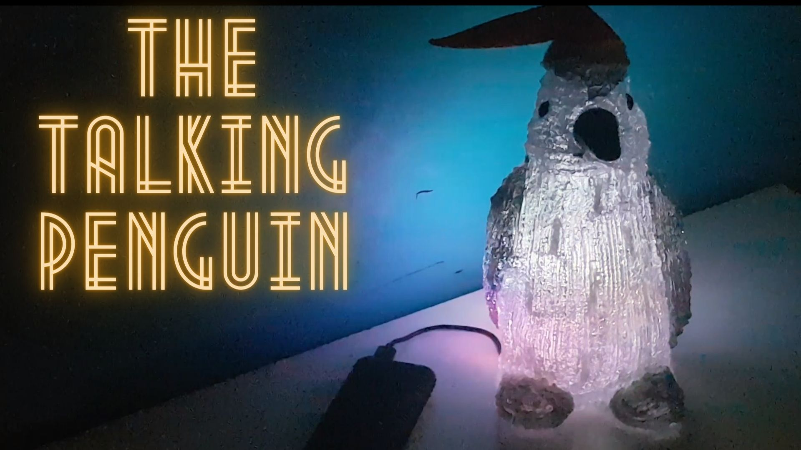

[]https://youtu.be/-NGkk2qvLvI)

# The talking penguin.

The Penguin will regularly voice the actual time and use its built-in Neopixels for a cozy Christmas feeling. Update the code from its clock function to speak over 1200+ other words. Or why not record your messages and make a unique Christmas ornament?

## Arduino code

This repository maintains the Arduino code for the project in folder `examples`.

## Instructable

My [instructable](https://www.instructables.com/member/debinix/instructables/) documents the project in detail.

## Recommended items to add for the project.

- Unexpected Maker's ESP32 TinyPICO microcontroller.
- Female stacking headers for ESP32 TinyPICO.
- Loudspeaker element, 8-32 Ohm.
- Talkie Speech Amplifier Shield.

Unexpected Maker ESP32 microcontroller

- ESP32 TinyPICO v3 - [Adafruit](https://www.adafruit.com/product/5028)
- ESP32 TinyPICO v2 or v3 - [Pimoroni](https://shop.pimoroni.com/search?q=tinyPICO)
- ESP32 TinyPICO v3 - [Lectronz](https://lectronz.com/products/tinypico-v3)
- ESP32 TinyPICO v3 - [UM Shop](https://unexpectedmaker.com/shop/tinypico-usbc)

The new `ESP32-S2` variant *may* work, and let me know if you try [this](https://www.adafruit.com/product/5029). The `Talkie Speech Amplifier Shield` is not *yet* tested in the S2 configuration. However, do **not** buy the new `ESP32-S3` model. The chip does not have the DAC.

Other ESP32 boards *may* work with the `Talkie Amplifier` board, but ensure that the DAC output is available on the module and is working. Use the DAC-test sketch in the `examples` folder. The exposed pin must be attached internally to the correct pin of Expressif's ESP32 chip. Check the schematics of the ESP32.

## Purchase the speech audio amplifier board.

The `Arduino Talkie Speech Amplifier` board is available fully assembled. [Tindie](https://www.tindie.com/products/28296/) and [Lectronz](https://lectronz.com/products/arduino-talkie-speech-amplifier-shield-for-esp32) have all the purchasing details.

 

I appreciate your support.

## Credits.

Thanks to `Armin Joachimsmeyer` for his refurbished version of the Arduino [Talkie speech library](https://github.com/ArminJo/Talkie).

